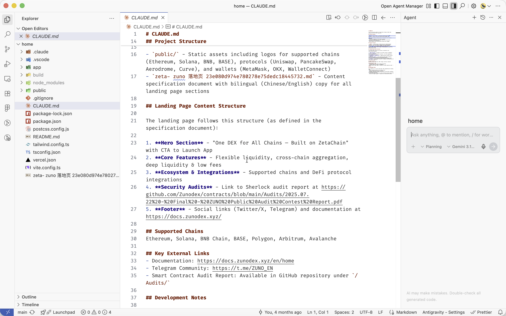
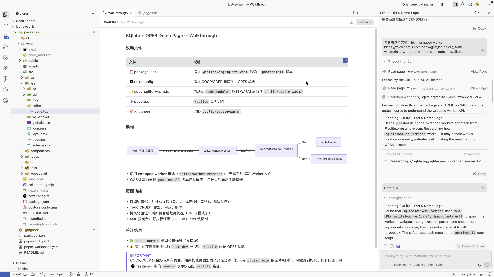
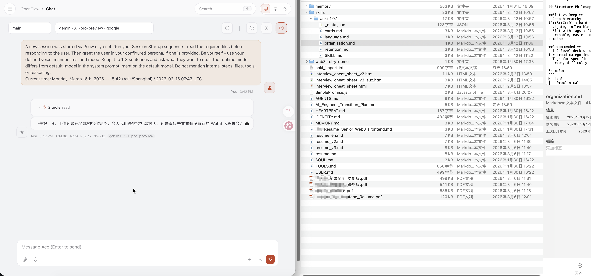

# AI 工作流程展示

> 🚀 **本项目是由 AI 纯靠 Vibe Coding 驱动开发出的最新成果！**
> 
> 目前项目还正在积极开发中。体验跨链交互的最核心入口可以查看：
> [`packages/web/src/app/page.tsx`](../packages/web/src/app/page.tsx)
> 这是一个完全由 AI Agent 构建的沉浸式对话交换界面。
> 
> 🌐 **在线体验地址：** [https://just-swap-it.vercel.app/](https://just-swap-it.vercel.app/)

以下是一些 AI 在实际开发中工作流程的截图展示：

## Claude Code 示例

*展示了 Claude Code 在终端中执行任务的界面。*

---

## Antigravity (Gemini Agent) 示例

*展示了内置 AI Agent (Antigravity) 在编辑器侧边栏中分析问题和执行步骤的详细工作流。*

---

## OpenClaw 示例

*展示了 OpenClaw + skills 在实际开发中的工作流程。*
